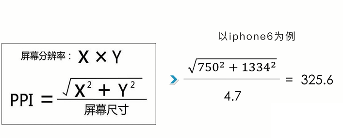
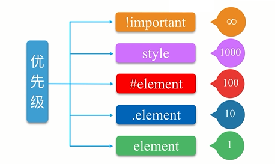

# 基本构成

- WXML：WeiXin Markup Language,标签语言，结合组件、WXS和事件系统
- WXSS
- WXS
- JavaScript


## WXML

特性
- 数据绑定
- 列表渲染
- 条件渲染
- 模板引用


标签属性
- id
- class
- style
- hidden
- data-*
- bind/catch

```
{{ flag ? true : false }}


<view wx:for="{{array}}" wx:foe-item="item" wx:key="index">
  {{index}}: {{item.message}}
</view>


<view wx:if="{{length === 1 }}"> 1 </view>
<view wx:elif="{{length === 2}}"> 2 </view>
<view wx:else> 3 </view>
```


模板
```
<template name="msgItem">
  <view>
    <text> {{index}}: {{msg}} </text>
    <text> Time: {{time}} </text>
  </view>
</template>

<template is="msgItem" data="{{...item}}"/>

Page({
  data: {
    item: {
      index: 0,
      msg: 'this is a template',
      time: '2016-09-15'
    }
  }
})

```

模板引用
```
<import scr="template.wxml">
<template is="templateName" data="{{...item}}"/>
```


## WXSS

WXSS:WeiXin Style Sheets

CSS:Cascading style Sheets

- 尺寸单位 rpx
- 样式导入
- 内敛样式
- 选择器

单位
- 设备像素:device pixels
- CSS像素：csspixels
- PPI/DPI:pixel per inch
- DPR: devicepixeRatio



```
@import "common.wxss";

<view style="color:{{color}};" />
```

选择器
```
.class	            .intro	            选择所有拥有 class="intro" 的组件
#id	                #firstname          选择拥有 id="firstname" 的组件
element	            view	            选择所有 view 组件
element, element	view, checkbox	    选择所有文档的 view 组件和所有的 checkbox 组件
::after	            view::after	        在 view 组件后边插入内容
::before	        view::before	    在 view 组件前边插入内容
```

优先级




