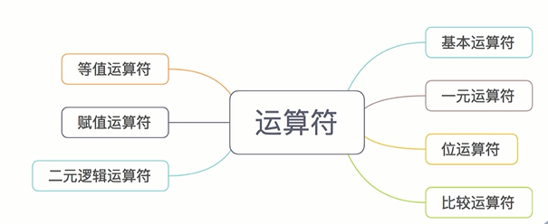
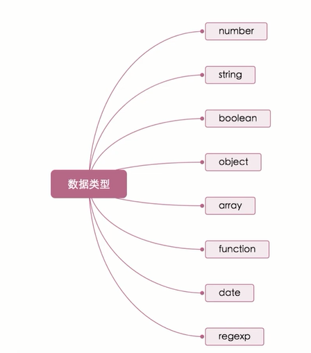

# JS

浏览器中JS
- ECMAScript
- DOM
- BOM

Nodejs中JavaScript
- ECMAScript
- Native
- NPM

小程序中JS
- ECMAScript
- 小程序框架
- API


ECMAScript
- 语法
- 类型
- 语句
- 关键字
- 操作符
- 对象


小程序中JS
- IOS -> JavaScriptCore
- android -> X5浏览器
- IED -> nwjs

## WXS

- 模块
- 变量
- 注释
- 运算符
- 语句
- 数据类型
- 基础类库

```js
// /pages/comm.wxs

var foo = "'hello world' from comm.wxs";
var bar = function(d) {
  return d;
}
module.exports = {
  foo: foo,
  bar: bar
};


<wxs src="./../tools.wxs" module="tools" />

var tools = require("./tools.wxs");
```

`<wxs>` 标签
- module
- src


module 属性
```
<wxs module="foo">
var some_msg = "hello world";
module.exports = {
    msg : some_msg,
}
</wxs>
<view> {{foo.msg}} </view>
```


保留标识符,以下标识符不能作为变量名：
```

delete 
void 
typeof

null 
undefined 
NaN 
Infinity 
var

if 
else 

true 
false

require

this 
function 
arguments
return

for
while
do
break
continue
switch
case
default
```

WXS注释：
```
// 方法一：单行注释

/*
方法二：多行注释
*/

/*
方法三：结尾注释。即从 /* 开始往后的所有 WXS 代码均被注释
```

运算符







基础类库


数据类型
- number ： 数值
- string ：字符串
- boolean：布尔值
- object：对象
- function：函数
- array : 数组
- date：日期
- regexp：正则


