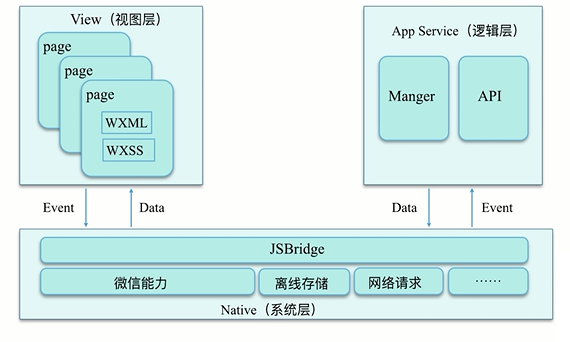
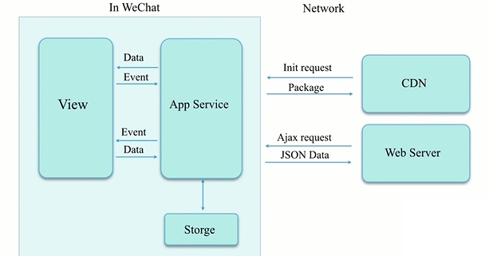
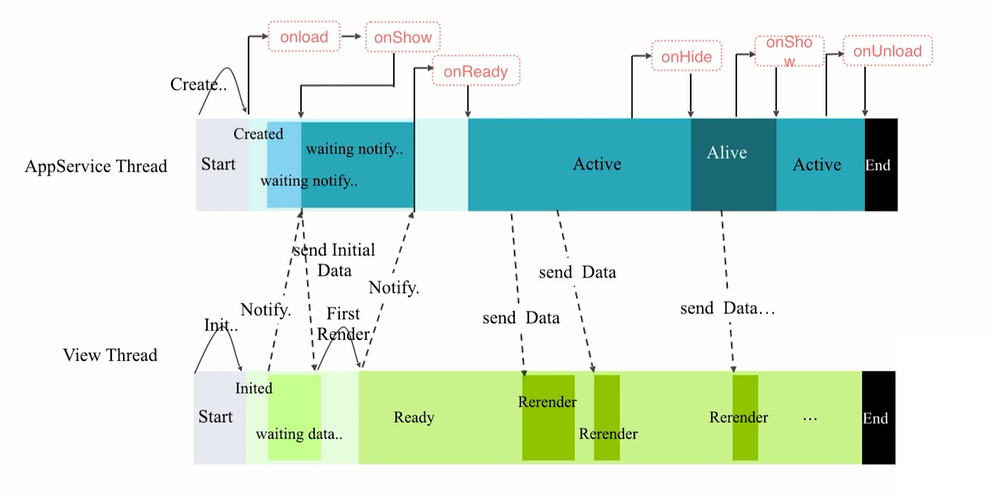
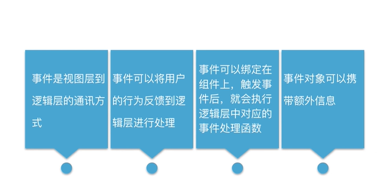
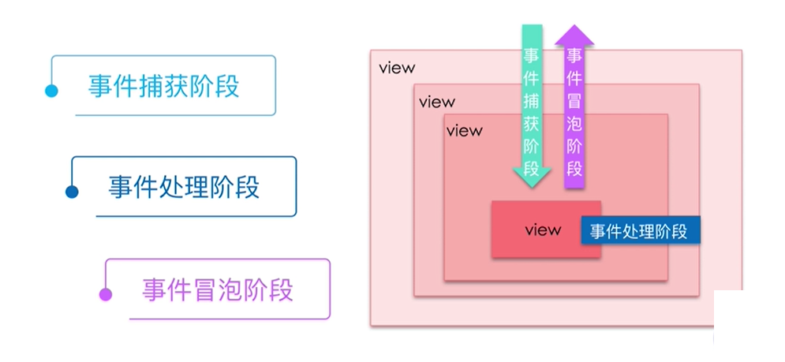

# MINA


框架




运行机制-启动
- 冷启动
- 热启动

强制更新机制

加载机制




## 应用生命周期

- onLaunch
- onShow	
- onHide	
- onError	
- onPageNotFound

- globalData


## 页面生命周期

- onLoad	
- onReady	
- onShow	
- onHide	
- onUnload




## 页面路由


getCurrentPages()，函数用于获取当前页面栈的实例，以数组形式按栈的顺序给出，第一个元素为首页，最后一个元素为当前页面。

```
打开新页面  wx.navigateTo   或使用组件 <navigator open-type="navigateTo"/>	
页面重定向  wx.redirectTo    或使用组件 <navigator open-type="redirectTo"/>
页面返回    wx.navigateBack 或使用组件<navigator open-type="navigateBack">
Tab 切换    wx.switchTab    或使用组件 <navigator open-type="switchTab"/>
重启动	    wx.reLaunch     或者 <navigator open-type="reLaunch"/>
```


## 事件




```js
Page({
  tapName: function(event) {
    console.log(event)
  }
})

{
"type":"tap",
"timeStamp":895,
"target": {
  "id": "tapTest",
  "dataset":  {
    "hi":"WeChat"
  }
},
"currentTarget":  {
  "id": "tapTest",
  "dataset": {
    "hi":"WeChat"
  }
},
"detail": {
  "x":53,
  "y":14
},
"touches":[{
  "identifier":0,
  "pageX":53,
  "pageY":14,
  "clientX":53,
  "clientY":14
}],
"changedTouches":[{
  "identifier":0,
  "pageX":53,
  "pageY":14,
  "clientX":53,
  "clientY":14
}]
}
```




